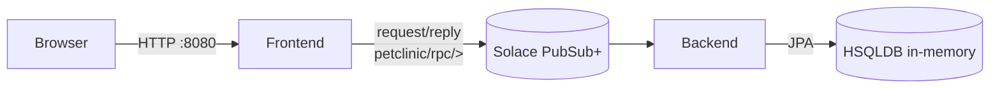
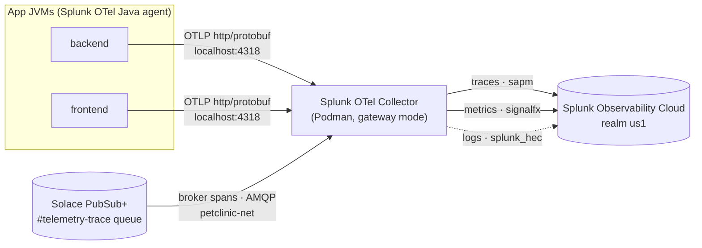

# Spring PetClinic — Solace-connected edition

A distributed take on the classic [Spring PetClinic](https://github.com/spring-projects/spring-petclinic)
sample. The application is split into **two standalone Spring Boot apps** that
communicate over a [Solace PubSub+](https://solace.com/products/event-broker/)
event broker using the **request/reply** pattern of the Solace PubSub+ Messaging API for Java.

| Application        | Folder                   | Port     | Responsibility                                                                                                                          |
| ------------------ | ------------------------ | -------- | --------------------------------------------------------------------------------------------------------------------------------------- |
| **Frontend** | [`frontend/`](frontend) | `8080` | Thymeleaf UI + controllers. Owns no database — every read/write is a synchronous Solace request/reply call to the backend.             |
| **Backend**  | [`backend/`](backend)   | `8081` | JPA persistence on an in-memory**HSQLDB** (seeded on startup). Subscribes to the RPC topics, executes the operation, and replies. |

## Architecture



- The **frontend** publishes a request to `petclinic/rpc/<operation>` and blocks
  on the reply (default timeout `10000 ms`, see `solace.request.timeout-ms`).
- The **backend** subscribes to `petclinic/rpc/>`, dispatches on the operation
  suffix, runs the JPA operation, and sends the reply.
- Message payloads are JSON (Jackson 2, shipped with Spring Boot 3.5).

### RPC topic contract

| Topic                                  | Operation                         |
| -------------------------------------- | --------------------------------- |
| `petclinic/rpc/owner/findById`       | Load one owner (with pets/visits) |
| `petclinic/rpc/owner/findByLastName` | Paged owner search                |
| `petclinic/rpc/owner/save`           | Create/update an owner aggregate  |
| `petclinic/rpc/pettype/findAll`      | List pet types                    |
| `petclinic/rpc/vet/findAll`          | List vets                         |
| `petclinic/rpc/vet/findAllPaged`     | Paged vet list                    |

Topic constants are shared by convention in both apps' `RpcTopics` classes
([backend](backend/src/main/java/org/springframework/samples/petclinic/messaging/RpcTopics.java),
[frontend](frontend/src/main/java/org/springframework/samples/petclinic/messaging/RpcTopics.java)),
where `PREFIX = "petclinic/rpc/"` is prepended to each operation suffix above.

#### Subscription & broker connection

- **Subscription name:** `petclinic/rpc/>` — a single wildcard subscription where `>`
  is the Solace multi-level wildcard that matches every operation topic above. The
  backend builds it as `RpcTopics.PREFIX + ">"` and binds it via
  `TopicSubscription.of(subscription)` on a `RequestReplyMessageReceiver` in
  [`SolaceRpcListener`](backend/src/main/java/org/springframework/samples/petclinic/messaging/SolaceRpcListener.java).
- **Publish topic:** the frontend sends each request to `petclinic/rpc/<operation>` via
  `Topic.of(RpcTopics.PREFIX + operation)` and `publisher.publishAwaitResponse(...)` in
  [`SolaceRpcClient`](frontend/src/main/java/org/springframework/samples/petclinic/messaging/SolaceRpcClient.java).
- **Broker connection** (defaults from [`SolaceConfig`](backend/src/main/java/org/springframework/samples/petclinic/messaging/SolaceConfig.java),
  overridable via `solace.*` in `application.properties`):
  - Host: `tcp://localhost:55554` (`solace.host`)
  - Message VPN: `default` (`solace.vpn`)
  - Username / password: `default` / `default` (`solace.username` / `solace.password`)

> **Implementation note:** both apps run on **Spring Boot 3.5** (Jackson 2, package
> `com.fasterxml.jackson`). They use the `solace-messaging-client` (PubSub+ Messaging
> API for Java) with a small hand-written `SolaceConfig` that builds the
> `MessagingService` bean directly, since there is no official Spring Boot starter
> for this newer API.

## Technology Stack

### Application Framework

- **Spring Boot 3.5** — modern Java application framework
- **Java 17** — bundled as Azul Zulu 17.0.19; set `JAVA_HOME` to override
- **Maven** — build tool (via system `mvn` or bundled `mvnw`)
- **Jackson 2** — JSON serialization (package `com.fasterxml.jackson`)

### Application Components

- **Frontend** (`frontend/pom.xml`) — **Thymeleaf** UI + Spring MVC controllers; exports OTLP traces/metrics via Splunk OTel Java agent
- **Backend** (`backend/pom.xml`) — **JPA/Hibernate** + **HSQLDB** in-memory; exposes RPC endpoints and persists data

### Event Broker & Messaging

- **Solace PubSub+** — runs as a **Podman** container (`docker.io/solace/solace-pubsub-standard:latest`)
- **Solace PubSub+ Messaging API for Java** (`solace-messaging-client`) — request/reply messaging; configured via `SolaceConfig` in each app
- **Netty 4.2.13.Final** — `solace-messaging-client` pulls in `sol-jcsmp`, which needs Netty 4.2.x; both `pom.xml` files override the `netty.version` property because Spring Boot's dependency management otherwise pins Netty to 4.1.x (see [Troubleshooting](#backend-fails-to-start-noclassdeffounderror-ionettychannelmultithreadioeventloopgroup))
- **Topic pattern:** `petclinic/rpc/<operation>` — frontend requestor, backend replier

### Observability

- **Splunk Distribution of OpenTelemetry Java agent** — bootstrapped via `-javaagent`; sends traces + metrics + logs (disabled by default) to OTLP/HTTP `:4318`
- **Splunk Distribution of OpenTelemetry Collector** — runs as a **Podman** container (`quay.io/signalfx/splunk-otel-collector:latest`); gateway mode that forwards to Splunk Observability Cloud (`realm=us1` by default)
- **OpenTelemetry SDK** — traces (SAPM), metrics (SignalFx protocol), logs (HEC, requires Log Observer)
- **Solace broker distributed tracing** — the Collector's bundled (beta) `solace` receiver consumes **broker-generated spans** from the `#telemetry-trace` queue over plaintext AMQP and forwards them to Splunk APM. Enabled on the broker by [`configure-solace-tracing.sh`](configure-solace-tracing.sh) and merged into the Collector via [`collector/solace-overlay.yaml`](collector/solace-overlay.yaml) — see [Monitoring the Solace broker](#monitoring-the-solace-broker-distributed-tracing)
- **End-to-end trace correlation** — the frontend and backend propagate the **W3C trace context** through each Solace message (the Splunk Java agent has no instrumentation for the native `com.solace.messaging` API), so the browser HTTP call, broker spans, and backend JDBC join a **single trace**. Uses the `pubsubplus-opentelemetry-java-integration` library — see [End-to-end trace correlation](#end-to-end-trace-correlation-context-propagation)

### Runtime & Containerization

- **Podman v6.0.2+** — container orchestration (macOS: applehv VM `podman-machine-default`, rootless)
- **Shared network** — the broker and Collector both attach to the `petclinic-net` podman network so the Collector's `solace` receiver can reach the broker by name (`petclinic-solace:5672`)
- **Scripting** — bash orchestration (`run-all.sh`, `run-otel.sh`, `run-collector.sh`, `configure-solace-tracing.sh`, `stop-all.sh`)
- **Ports:**
  - Frontend: `:8080`
  - Backend: `:8081`
  - Solace SMF: `:55554` (published from `:55555` inside container)
  - Solace Manager UI: `:8088`
  - Solace AMQP: `:5672` (in-container only; the Collector reaches it over the shared `petclinic-net` network)
  - OTel Collector OTLP/gRPC: `:4317`
  - OTel Collector OTLP/HTTP: `:4318`
  - OTel Collector health: `:13133`

## Prerequisites

- **JDK 17+** (full JDK, not a JRE)
- **Maven** on your `PATH` (the bundled `./mvnw` wrapper is not configured in this
  repo, so the scripts fall back to system `mvn`)
- **Podman** (or Docker), to run the Solace broker
- `curl`, `nc`, and `lsof` (used by the start/stop scripts for health checks and
  shutdown; preinstalled on macOS)

## Running the distributed edition

The quickest way is the **`run-all.sh`** orchestrator, which starts the broker,
waits for it, then brings up the apps in order:

```bash
./run-all.sh            # start solace + backend + frontend (default)
./run-all.sh apps       # backend then frontend (broker already running)
./run-all.sh solace     # just the broker (detached container)
./run-all.sh backend    # just the backend (foreground, live logs, Ctrl+C stops)
./run-all.sh frontend   # just the frontend (foreground, live logs, Ctrl+C stops)
```

- A **single** requested app runs in the foreground with live logs (Ctrl+C stops it).
- **Multiple** apps run in the background with logs written to [`logs/`](logs) and
  are stopped together with Ctrl+C.
- The **broker** always runs detached; stop it with `./stop-all.sh solace`.

Stop services with the mirror script **`stop-all.sh`** (reverse order:
frontend, backend, solace):

```bash
./stop-all.sh           # stop everything (default)
./stop-all.sh apps      # stop frontend + backend, leave the broker up
./stop-all.sh frontend  # stop just the frontend
./stop-all.sh solace    # stop and remove the broker container
```

### Running with the Splunk OpenTelemetry Java agent

To bring the stack up with each app instrumented by the **Splunk Distribution of
OpenTelemetry Java agent**, use **`run-otel.sh`** instead of `run-all.sh`. It
launches the packaged Spring Boot fat jars directly (one JVM per app) with
`-javaagent` bootstrapped, so each app reports as its own service in Splunk APM:

```bash
./run-otel.sh            # broker + backend + frontend, agent attached (default)
./run-otel.sh apps       # backend then frontend (broker already up)
./run-otel.sh backend    # just the backend (foreground, live logs)
./run-otel.sh build      # force a `mvn package` rebuild before starting
OTEL_ENABLED=false ./run-otel.sh apps   # run the jars without the agent
```

The script launches the apps as packaged Spring Boot fat jars (not via Maven) with the Splunk OTel Java agent attached via `-javaagent`. Each app reports to Splunk APM as its own service:

- **Backend:** `gary-petclinic-solace-backend`
- **Frontend:** `gary-petclinic-solace-frontend`

**Runtime environment:** Apps run on the bundled **Azul Zulu 17.0.19** JRE in [`jre/`](jre); override with `JAVA_HOME` if needed.

**Telemetry routing:** Traces and metrics are always sent to the **local Collector** on `localhost:4318` (OTLP/HTTP). Logs are disabled by default (see the [logs caveat](#collector-logs-a-404-not-found-on-v1log-and-drops-data) below). The script forces `-Dsplunk.realm=none` on the agent to prevent a `SPLUNK_REALM` value in `.env` from making the agent bypass the Collector and send directly to Splunk. If the Collector is not already running, `run-otel.sh` starts it automatically (see [The Splunk OpenTelemetry Collector](#the-splunk-opentelemetry-collector) below).

**Broker tracing:** When `run-otel.sh` starts the Solace broker it also runs [`configure-solace-tracing.sh`](configure-solace-tracing.sh), so the Collector receives **broker-generated spans** in addition to the app traces (see [Monitoring the Solace broker](#monitoring-the-solace-broker-distributed-tracing) below). The step is idempotent and non-fatal — if it fails the apps still run, only broker spans are missing.

**Configuration:** Agent settings are in a config block at the top of `run-otel.sh` and can be overridden from the environment (e.g. `OTEL_SERVICE_NAME`, `OTEL_EXPORTER_OTLP_ENDPOINT`, `OTEL_RESOURCE_ATTRIBUTES`, `OTEL_LOGS_EXPORTER`). For defaults, see the [Observability defaults table](#observability-defaults-in-run-oetelsh) above.

**Credentials:** The realm and access token belong to the **Collector**, not the agent. Both `run-otel.sh` and `run-collector.sh` auto-load them from a gitignored **`.env`** file in the repo root — copy [`.env.example`](.env.example) to `.env` and fill in your Splunk realm and org access token.

**Stopping:** Use `./stop-all.sh` to stop the apps and broker (the Collector stays running). Stop just the Collector with `./run-collector.sh down`.

Once the stack is up, open the **launcher page** [`index.html`](index.html) in a
browser for quick links, or go straight to:

| Service                | URL                                                                           | Notes                            |
| ---------------------- | ----------------------------------------------------------------------------- | -------------------------------- |
| PetClinic UI           | [http://localhost:8080/](http://localhost:8080/)                               | Thymeleaf frontend               |
| Backend health         | [http://localhost:8081/actuator/health](http://localhost:8081/actuator/health) | Spring Boot Actuator             |
| Solace PubSub+ Manager | [http://localhost:8088/](http://localhost:8088/)                               | broker admin,`admin`/`admin` |

### The Splunk OpenTelemetry Collector

Instead of shipping telemetry from each JVM straight to Splunk Observability
Cloud, the apps export to a **local Splunk Distribution of the OpenTelemetry
Collector** running as a Podman container. The Collector fans the data out to the
cloud, so credentials and export config live in one place:



**Manage it with [`run-collector.sh`](run-collector.sh):**

```bash
./run-collector.sh up       # pull (if needed) and (re)start the Collector [default]
./run-collector.sh status   # show container state and published ports
./run-collector.sh logs     # follow the Collector logs
./run-collector.sh down     # stop and remove the Collector container
```

`run-otel.sh` also calls the Collector automatically: before it launches the app
JVMs it checks the health endpoint and runs `./run-collector.sh up` if nothing is
listening, so `./run-otel.sh all` is enough to bring up the whole pipeline.

**How it starts.** `run-collector.sh up` runs the image detached with a restart
policy, injects the credentials from `.env` via the environment (never the command
line), attaches the container to the shared `petclinic-net` network, mounts the
Solace overlay, and passes **two** `--config` flags (the bundled gateway config
plus the overlay, which the Collector deep-merges), then waits for the container to
report healthy on `:13133`:

```bash
podman run -d --replace --name splunk-otel-collector --restart unless-stopped \
  --network petclinic-net \
  -e SPLUNK_ACCESS_TOKEN -e SPLUNK_REALM \
  -e SPLUNK_MEMORY_TOTAL_MIB=512 -e SPLUNK_LISTEN_INTERFACE=0.0.0.0 \
  -e SOLACE_TELEMETRY_USERNAME -e SOLACE_TELEMETRY_PASSWORD -e SOLACE_TELEMETRY_PROFILE \
  -v "$PWD/collector/solace-overlay.yaml:/etc/otel/collector/solace-overlay.yaml:ro" \
  -p 4317:4317 -p 4318:4318 -p 13133:13133 \
  quay.io/signalfx/splunk-otel-collector:latest \
  --config=/etc/otel/collector/gateway_config.yaml \
  --config=/etc/otel/collector/solace-overlay.yaml
```

**Configuration.** Everything is driven by environment variables (set them in
`.env`, or export them to override the script defaults):

| Variable                    | Default                                           | Purpose                                                        |
| --------------------------- | ------------------------------------------------- | -------------------------------------------------------------- |
| `SPLUNK_REALM`            | _(required)_                                    | Splunk O11y realm, e.g.`us1` — derives the cloud endpoints. |
| `SPLUNK_ACCESS_TOKEN`     | _(required)_                                    | Org access token used to authenticate ingest.                  |
| `SPLUNK_CONFIG`           | `/etc/otel/collector/gateway_config.yaml`       | Which bundled config the Collector loads (gateway mode).       |
| `SPLUNK_MEMORY_TOTAL_MIB` | `512`                                           | Total memory budget for the`memory_limiter` processor.       |
| `SPLUNK_LISTEN_INTERFACE` | `0.0.0.0`                                       | Bind address inside the container (so published ports work).   |
| `SPLUNK_COLLECTOR_IMAGE`  | `quay.io/signalfx/splunk-otel-collector:latest` | Collector image to run.                                        |
| `SPLUNK_COLLECTOR_NAME`   | `splunk-otel-collector`                         | Container name.                                                |
| `COLLECTOR_HEALTH_URL`    | `http://localhost:13133`                        | Health endpoint the scripts poll before continuing.            |
| `PETCLINIC_NET`           | `petclinic-net`                                 | Shared podman network the broker + Collector attach to.        |
| `SOLACE_TELEMETRY_USERNAME` | `otel-collector`                              | Telemetry client-username the `solace` receiver authenticates as. |
| `SOLACE_TELEMETRY_PASSWORD` | `otel-collector`                              | Password for that client-username.                             |
| `SOLACE_TELEMETRY_PROFILE`  | `trace`                                       | Telemetry profile name; selects the `queue://#telemetry-<profile>` source. |

**Published ports:** `4317` (OTLP/gRPC), `4318` (OTLP/HTTP — the agent target),
and `13133` (health check).

**Bundled pipelines.** The Collector runs the stock `gateway_config.yaml`, whose
export endpoints are all derived from `SPLUNK_REALM`:

| Signal  | Exporter       | Destination                                           |
| ------- | -------------- | ----------------------------------------------------- |
| Traces  | `sapm`       | `https://ingest.<realm>.signalfx.com/v2/trace/otlp` |
| Metrics | `signalfx`   | `https://ingest.<realm>.signalfx.com`               |
| Logs    | `splunk_hec` | `${SPLUNK_HEC_URL}` (`/v1/log`)                   |

> The Solace overlay adds one more traces pipeline (`traces/solace`) on top of
> these for broker spans, reusing the same `memory_limiter` + `batch` processors
> and the `otlp_http` exporter — see
> [Monitoring the Solace broker](#monitoring-the-solace-broker-distributed-tracing).

> The collector image is **distroless** (no shell/`cat`); to inspect the bundled
> config, copy it out with `podman cp splunk-otel-collector:/etc/otel/collector/gateway_config.yaml -`.
>
> **Logs caveat:** Splunk Observability Cloud only ingests logs when the org has
> **Log Observer** (a valid `SPLUNK_HEC_URL` + HEC token); otherwise the
> `splunk_hec` exporter 404s on `/v1/log` and drops the data. `run-otel.sh`
> therefore ships **traces and metrics only** by default (`OTEL_LOGS_EXPORTER=none`).
> Wire a working `SPLUNK_HEC_URL`/`SPLUNK_HEC_TOKEN` into the Collector and start
> the apps with `OTEL_LOGS_EXPORTER=otlp` to forward logs as well.

#### Getting into / debugging the Collector container

You **can't** open a shell inside the Collector — the image is distroless, so its
only executable is the `/otelcol` entrypoint (there's no `/bin/sh`, `ls`, or
`cat`, and `podman exec -it … ` fails with exit code `125`). Use these instead:

```bash
# 1. Run the collector binary (the only executable in the image)
podman exec splunk-otel-collector /otelcol --version      # -> otelcol version vX.Y.Z
podman exec splunk-otel-collector /otelcol components      # list receivers/exporters/etc.

# 2. Read files out of the container (no shell needed)
podman cp splunk-otel-collector:/etc/otel/collector/gateway_config.yaml -   # to stdout
podman cp splunk-otel-collector:/etc/otel/collector/ ./collector-config/    # to a folder

# 3. Get a real shell that shares the collector's network + PID namespaces,
#    then browse its filesystem via /proc/1/root
podman run --rm -it \
  --pid=container:splunk-otel-collector \
  --network=container:splunk-otel-collector \
  docker.io/nicolaka/netshoot
#   inside: ls -l /proc/1/root/etc/otel/collector/ ; curl -s localhost:13133 ; ss -ltnp

# 4. Logs and metadata from the host (no exec)
podman logs -f splunk-otel-collector      # or: ./run-collector.sh logs
podman inspect splunk-otel-collector
```

To SSH into the **Podman VM** itself (not the container) use `podman machine ssh`.
To get a shell *inside* the Collector — since Splunk publishes only distroless
images — build your own debug image by copying the binary and config from the
official image into a base with a shell (e.g. `FROM debian:bookworm-slim`), then
point `SPLUNK_COLLECTOR_IMAGE` to your local image in `.env`.

#### Monitoring the Solace broker (distributed tracing)

Beyond the app JVMs, the Collector also ingests **broker-generated spans** from the
Solace PubSub+ broker itself. The bundled (beta) `solace` receiver binds to the
broker's `#telemetry-trace` queue over plaintext AMQP and feeds a dedicated
`traces/solace` pipeline that reuses the base `memory_limiter` + `batch` processors
and the `otlp_http` exporter (Splunk APM ingest). It is wired up in two places:

- **On the Collector** — [`collector/solace-overlay.yaml`](collector/solace-overlay.yaml)
  is mounted into the container and merged onto the bundled `gateway_config.yaml`
  via a second `--config` flag (OTel deep-merges the two, so the overlay only
  *adds* the `solace` receiver and `traces/solace` pipeline). The broker address,
  telemetry credentials, and profile come from the environment
  (`SOLACE_TELEMETRY_USERNAME` / `SOLACE_TELEMETRY_PASSWORD` /
  `SOLACE_TELEMETRY_PROFILE`, forwarded from `.env`). The broker and Collector
  share the `petclinic-net` network so the receiver can reach the broker by name
  (`petclinic-solace:5672`).

- **On the broker** — [`configure-solace-tracing.sh`](configure-solace-tracing.sh)
  drives the broker's SEMPv2 API (idempotently) to enable distributed tracing: it
  turns on the telemetry profile + receiver, adds a trace filter subscribed to
  `petclinic/rpc/>`, creates the `otel-collector` telemetry client-username, and
  switches the VPN to internal basic auth. `run-otel.sh` runs it automatically
  after starting the broker; run it by hand any time with
  `./configure-solace-tracing.sh`.

> **Why a promotion queue?** Solace only generates trace spans for **guaranteed**
> or **"promoted direct"** messages — a *pure* direct message is traced only when a
> queue also attracts (spools) it. PetClinic RPC is pure-direct request/reply, so
> the script also creates a small, TTL-bounded queue (`q-petclinic-trace`,
> `maxTtl=10s`, capped spool) subscribed to `petclinic/rpc/>`. It promotes each
> direct request so the broker emits spans, then auto-expires the spooled copies so
> the queue never grows. Without it the broker produces **zero** spans even though
> tracing is enabled. Tune it with `SOLACE_TRACE_PROMOTE_QUEUE`,
> `SOLACE_TRACE_PROMOTE_TTL`, and `SOLACE_TRACE_PROMOTE_SPOOL_MB` in `.env`.

Verify broker spans are flowing — the `#telemetry-trace` queue's consumer-flow ack
count climbs as RPC traffic runs (browse the PubSub+ Manager **Telemetry** view, or
query SEMP):

```bash
curl -s -u admin:admin \
  "http://localhost:8088/SEMP/v2/monitor/msgVpns/default/queues/%23telemetry-trace/txFlows" \
  | python3 -c 'import sys, json; print(json.load(sys.stdin)["data"])'
```

#### End-to-end trace correlation (context propagation)

Broker spans alone don't stitch the **frontend** and **backend** JVMs into one
trace: the Splunk OpenTelemetry Java agent auto-instruments each app's inbound HTTP
and outbound JDBC, but it has **no instrumentation for the native
`com.solace.messaging` API**, so the trace context never crosses the broker on its
own. The apps therefore propagate the **W3C `traceparent`** through the Solace
message manually, using the `com.solace:pubsubplus-opentelemetry-java-integration`
library (added to both `pom.xml` files alongside `io.opentelemetry:opentelemetry-api`,
whose SDK is supplied by the agent at runtime):

- **Frontend** ([`SolaceRpcClient`](frontend/src/main/java/org/springframework/samples/petclinic/messaging/SolaceRpcClient.java))
  — `callRaw` opens a `PRODUCER` span and **injects** the current context into the
  outbound message with `SolacePubSubPlusJavaTextMapSetter` before
  `publishAwaitResponse`.
- **Backend** ([`SolaceRpcListener`](backend/src/main/java/org/springframework/samples/petclinic/messaging/SolaceRpcListener.java))
  — `handleRequest` **extracts** the context with `SolacePubSubPlusJavaTextMapGetter`,
  opens a `CONSUMER` span parented to it, and runs the dispatch (and its JPA/JDBC
  work) inside that span's scope so the database spans nest under the same trace.

The result is a single distributed trace in Splunk APM — **browser HTTP → frontend
→ Solace broker → backend → HSQLDB** — with the broker's own send/receive spans
(from the promotion queue above) linked in between.

### Starting the services manually

If you prefer to run each piece yourself:

1. **Start the Solace broker** (plain `podman run`, no Compose):

   ```bash
   podman run -d --name petclinic-solace --hostname solace \
     --shm-size=2g --ulimit core=-1 --ulimit nofile=2448:1048576 -m 3500m \
     -p 55554:55555 -p 8008:8008 -p 1943:1943 -p 8088:8080 \
     -e username_admin_globalaccesslevel=admin \
     -e username_admin_password=admin \
     -e system_scaling_maxconnectioncount=100 \
     docker.io/solace/solace-pubsub-standard:latest
   ```

   The broker's SMF port `55555` is published on the host as `55554` (host TCP
   `55555` is reserved on this machine by Cisco Secure Client). The PubSub+ Manager
   UI is at [http://localhost:8088](http://localhost:8088) (login `admin` / `admin`).
   Wait until the container is healthy before starting the apps.
2. **Start the backend** (persistence + replier):

   ```bash
   mvn -f backend/pom.xml spring-boot:run
   ```
3. **Start the frontend** (UI + requestor):

   ```bash
   mvn -f frontend/pom.xml spring-boot:run
   ```
4. Open the PetClinic UI at [http://localhost:8080/](http://localhost:8080/).

Both apps read their broker coordinates from `solace.*` properties in their
`application.properties`:

| Property            | Default                   |
| ------------------- | ------------------------- |
| `solace.host`     | `tcp://localhost:55554` |
| `solace.vpn`      | `default`               |
| `solace.username` | `default`               |
| `solace.password` | `default`               |

Override them with environment variables or `--solace.host=...` when pointing at a
different broker.

### Observability defaults in `run-otel.sh`

When using `./run-otel.sh`, the bundled Splunk OpenTelemetry Java agent applies these
defaults (override from environment):

| Variable                        | Default                                            | Purpose                                                |
| ------------------------------- | -------------------------------------------------- | ------------------------------------------------------ |
| `OTEL_SERVICE_NAME`           | _(per-app: backend/frontend)_                    | Service name reported to Splunk APM.                   |
| `OTEL_EXPORTER_OTLP_ENDPOINT` | `http://localhost:4318`                          | Collector HTTP endpoint (OTLP/HTTP, not direct cloud). |
| `OTEL_EXPORTER_OTLP_PROTOCOL` | `http/protobuf`                                  | OTLP protocol.                                         |
| `OTEL_LOGS_EXPORTER`          | `none`                                           | Disable agent log export (requires Log Observer).      |
| `OTEL_RESOURCE_ATTRIBUTES`    | `deployment.environment=lab,service.version=1.0` | Resource metadata.                                     |
| `OTEL_ENABLED`                | `true`                                           | Set to`false` to run jars without the agent.         |

## Viewing logs

When `run-all.sh` runs apps in the background, each writes to its own file under
[`logs/`](logs). Tail them to watch what a service is doing:

```bash
# frontend (UI + PubSub+ requestor)
tail -f logs/frontend.log

# backend (persistence + PubSub+ replier)
tail -f logs/backend.log
```

If you started an app in the **foreground** (e.g. `./run-all.sh backend`), its log
is printed straight to the terminal instead of a file.

The **Solace broker** logs come from the container:

```bash
# follow the broker's logs
podman logs -f petclinic-solace

# last 200 lines only
podman logs --tail 200 petclinic-solace
```

The broker also exposes its logs and event details in the PubSub+ Manager UI at
[http://localhost:8088](http://localhost:8088).

## Troubleshooting

### Collector logs a `404 Not Found` on `/v1/log` and drops data

**Symptom** — the Collector logs repeat an error like:

```
Exporting failed. Dropping data. ... "error": "Permanent error: \"HTTP/... 404 Not Found\"" ...
exporter: splunk_hec ... url: .../v1/log
```

**Cause** — the app's OTel Java agent is exporting **logs** to the Collector,
whose `splunk_hec` exporter POSTs them to `.../v1/log`. Splunk Observability Cloud
only accepts that endpoint when the org has **Log Observer** provisioned (a valid
`SPLUNK_HEC_URL` + HEC token). Without it, every log batch 404s, is retried, and
then dropped. Traces (`sapm`) and metrics (`signalfx`) are unaffected.

**Fix** — `run-otel.sh` disables agent log export by default
(`OTEL_LOGS_EXPORTER=none`, passed to the agent as `-Dotel.logs.exporter=none`), so
no logs reach the Collector and there is nothing for `splunk_hec` to drop. The
change only takes effect on app **restart**; if the Collector is still retrying a
queued batch, restart it too with `./run-collector.sh up`.

**To actually send logs** — provision Log Observer, wire a working
`SPLUNK_HEC_URL` / `SPLUNK_HEC_TOKEN` into the Collector's `splunk_hec` exporter,
then start the apps with log export turned back on:

```bash
OTEL_LOGS_EXPORTER=otlp ./run-otel.sh
```

Verify the errors are gone after restarting:

```bash
podman logs splunk-otel-collector 2>&1 | grep -aE 'splunk_hec|/v1/log|404|Dropping data'
```

### Backend fails to start: `NoClassDefFoundError: io/netty/channel/MultiThreadIoEventLoopGroup`

**Symptom** — the backend (or frontend) exits during startup while building the
`MessagingService` bean:

```
java.lang.NoClassDefFoundError: io/netty/channel/MultiThreadIoEventLoopGroup
    at com.solace.transport.impl.netty... (sol-jcsmp-<ver>.jar)
```

**Cause** — the `solace-messaging-client` PubSub+ Messaging API wraps `sol-jcsmp`,
which requires **Netty 4.2.x** (the missing class was introduced in Netty 4.2).
Spring Boot's dependency management otherwise pins Netty down to **4.1.x**, which
does not contain that class, so the transitive version is forced too low.

**Fix** — both `backend/pom.xml` and `frontend/pom.xml` override the managed Netty
version:

```xml
<properties>
  <netty.version>4.2.13.Final</netty.version>
</properties>
```

Rebuild the affected app after changing the property:

```bash
mvn -f backend/pom.xml -DskipTests package
mvn -f frontend/pom.xml -DskipTests package
```

Netty is only on the classpath because of Solace (the apps use Tomcat, not
WebFlux), so aligning it to 4.2.x is safe. Confirm the resolved version with
`mvn -f backend/pom.xml dependency:tree -Dincludes=io.netty`.

## Building container images

There is no `Dockerfile`. Build an OCI image for each app with the Spring Boot
build plugin:

```bash
mvn -f backend/pom.xml spring-boot:build-image
mvn -f frontend/pom.xml spring-boot:build-image
```

Run the frontend image (the Solace broker and backend must already be running):

```bash
podman run -p 8080:8080 docker.io/library/spring-petclinic-frontend:4.0.0-SNAPSHOT
```

## License

The Spring PetClinic sample application is released under version 2.0 of the
[Apache License](https://www.apache.org/licenses/LICENSE-2.0). See
[LICENSE.txt](LICENSE.txt).
